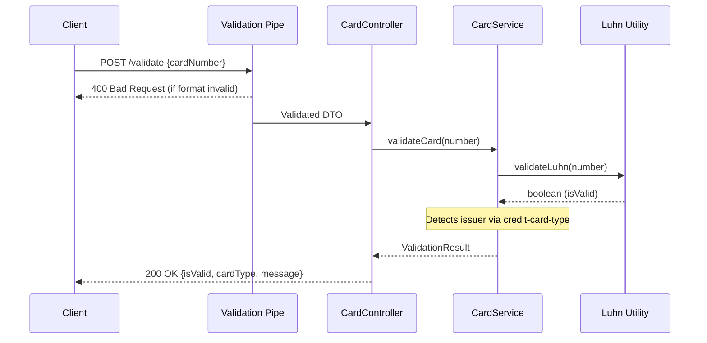

# Card Validation API

A robust NestJS-based API for validating credit card numbers using the Luhn algorithm and identifying card issuers.

## Features

- **Luhn Algorithm Validation**: Verifies the mathematical validity of credit card numbers.
- **Card Type Identification**: Automatically identifies the card issuer (Visa, Mastercard, etc.) using the `credit-card-type` library.
- **Strict TypeScript Configuration**: Built with `strict: true` enabled in `tsconfig.json` for maximum type safety.
- **Health Monitoring**: Includes a `/health` endpoint to monitor server status and environment.
- **Interactive Documentation**: Full OpenAPI/Swagger documentation available via Swagger UI.
- **Request Validation**: Robust input validation using `class-validator` and `class-transformer`.

---

## 📁 Folder Structure

The project follows a **Modular Architecture**, ensuring high maintainability and separation of concerns.

```text
card_validation/
├── src/                    # Source code root
│   ├── common/             # Shared utilities and helpers
│   │   └── utils/          
│   │       └── luhn.util.ts # Pure logic for Luhn algorithm
│   ├── modules/            # Domain-specific modules
│   │   ├── dto/            # Data Transfer Objects (Request schemas)
│   │   │   └── dto.ts      
│   │   ├── controller.ts   # HTTP Route handlers
│   │   ├── service.ts      # Business logic (Validation coordination)
│   │   └── module.ts       # Module definition and dependency wiring
│   ├── app.controller.ts   # Global handlers (e.g., Health check)
│   ├── app.module.ts       # Root application module
├── main.ts                 # Application entry point & bootstrap
├── tsconfig.json           # TypeScript configuration (Strict mode)
└── package.json            # Dependencies and scripts
```

---

## 🛠 Tech Stack & Rationale

| Technology | Role | Why it was used? |
| :--- | :--- | :--- |
| **NestJS** | Core Framework | Provides a robust architecture with dependency injection, making code modular and testable. |
| **TypeScript** | Language | Static typing catches errors early. `strict: true` ensures maximum code quality. |
| **Swagger** | Documentation | Automatically generates an interactive UI (`/api`) for easy API testing. |
| **credit-card-type** | Issuer Detection | Specialized library for accurate identification of card brands (Visa, MC, etc.). |
| **class-validator** | Validation | Allows declarative validation using decorators in DTOs. |

---

## 🏗 System Architecture

### Request Lifecycle



### The Luhn Algorithm
The [Luhn algorithm](https://en.wikipedia.org/wiki/Luhn_algorithm) is the industry standard for validating identification numbers. It was chosen because:
- **Efficiency**: Runs in $O(n)$ time (single pass).
- **Reliability**: Catches any single-digit error and most transpositions of adjacent digits.
- **Compliance**: It is the mandatory first step for processing any modern credit card number.

---

## 🚀 Getting Started

### Prerequisites
- Node.js (v14+)
- npm

### Installation
```bash
npm install
```

### Running the Application
```bash
npm run devStart
```
The server will start on `http://localhost:3000`.

## 📡 API Endpoints

### 1. Validate Card Number
- **Route**: `POST /validate`
- **Description**: Validates a credit card number using the Luhn checksum algorithm and identifies the issuing network.
- **Request Body**:
  ```json
  {
    "cardNumber": "string (13-19 digits)"
  }
  ```
- **Validation Rules**:
  - Must be a string of digits only.
  - Length must be between 13 and 19 characters.
- **How it works**:
  1. The **Validation Pipe** first checks the string format and length constraints.
  2. The **Luhn Utility** performs the mathematical checksum to verify the number is structurally valid.
  3. The **Credit Card Type** library runs a pattern match to identify the brand (Visa, Mastercard, etc.).
  4. Returns a result even if the Luhn check fails (identifying the card type regardless of mathematical validity).
- **Sample Response**:
  ```json
  {
    "isValid": false,
    "cardType": "Visa",
    "message": "Invalid check digit (Luhn algorithm failure)"
  }
  ```

### 2. System Health Check
- **Route**: `GET /health`
- **Description**: Provides the current operational status of the API and environment details.
- **How it works**:
  - Checks if the Node.js process is responsive.
  - Returns the current server timestamp and the active environment (`development`, `production`, etc.).
- **Sample Response**:
  ```json
  {
    "status": "ok",
    "message": "Server is running",
    "timestamp": "2026-04-29T10:00:00.000Z",
    "environment": "development"
  }
  ```

### 3. API Documentation
- **Route**: `GET /api`
- **Description**: Accesses the interactive Swagger UI.
- **How it works**:
  - Serves an auto-generated documentation page based on the `@nestjs/swagger` decorators in the code.
  - Allows for direct testing of endpoints from the browser.
👉 [http://localhost:3000/api](http://localhost:3000/api)

---

## License
This project is licensed under the ISC License.
